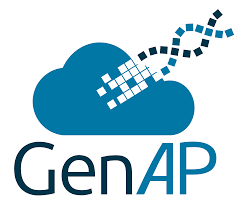

# Tutorials for utilizing scRNA-seq tools in GenAP2

 

This repo holds the tutorials for the GenAP2 implementations of single-cell analysis pipelines.

To begin exploring the tutorials, please navigate to the overview page:

[Start here](./tutorials/tutorial_overview.md)