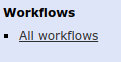

Using single-cell tools in GenAP v2-test
================
FlorianW
24/02/2020

# How to use single-cell tools in GenAP v2-test

## Introduction

In this markdown, we will explore, how to use the single-cell tools
implemented in the GenAP v2 galaxy alongside the visualisation app SCAP.
The exaplanations in this document are currently geared for usage on the
v2-test server but should work just as well for the final
implementations on the v2 production server. We will start with a short
explanation of how to use the GenAP2 portal and how to import data into
Galaxy. followed by running 2 standard pipelines for single-cell
analysis (Seurat and Scanpy). Finally, we will export the data to the
Filebrowser and import our clustering results to SCAP.

## Reporting problems

If you encounter any bugs or issues with any of the tools in GenAP2,
please send an email with your problem described in detail to the
following address:

**<support@genap.ca>**

This allows us to keep track of issues and resolve them in an organized
manner. Thank you for your collaboration in using this way of reporting
problems\!s

## Using GenAP v2-test

First we will go to the new GenAP hub and login using our Compute Canada
(CC) credentials. Go to \[<https://v2-test.genap.ca/>\]
(<https://v2-test.genap.ca/>) and login using your CC login details (the
same information you would use to access a computational cluster like
Beluga or Cedar).

Once you are logged in, you will see a dashboard that will have several
controls on the left and a main window that says My Workspaces. Now if
you are logging in for the first time, there is a good chance, that you
do not have access to any Workspaces yet. In this case, you can create
Workspace by clicking on Create Workspace. Workspace creation is
currently limited to principal investigators of groups and you might
therefore not have permission to create a Workspace at this time. For
your convenience, I have created a folder for your lab to test the tools
on v2-test. You should see a Workspace in the form of \[Your PI
name\]\_lab.

Workspaces are the main working area of GenAP2. Inside of these
workspaces, we can install several applications to perform various types
of jobs. You can know the current status of an app by checking the
coloured bar at the top right box of an app. The status can either be
Stopped, Stopping, Starting or Running.

**1) Galaxy**

The main application we will use to perform analysis is called
[Galaxy](https://usegalaxy.org/). To learn more about Galaxy in general
and how to use it in detail, you can visit the [Learn
Galaxy](https://galaxyproject.org/learn/) website from the Galaxy
Community, which contains lots of helpful information and examples.

**2) File Browser**

The File Browser is our main app to upload data to GenAp and to transfer
it to different apps. Think of it as a post station to transfer your
data between different GenAP apps.

**3) SCAP**

SCAP is a lightweight visualisation app developed specifically for
GenAP2 that can help you visualize and annotate your single-cell data
downstream of Galaxy. It is currently in it’s alpha version but is
continually being improved with new features.

## Using Galaxy for single-cell analysis

### Uploading data

Now that you have familiarized yourself a bit with the GenAP2 interface,
let’s start uploading some data and testing some of the single-cell
pipelines implemented. To upload data to Galaxy, we first need to put it
into the Filebrowser. Click on the launch button
 for the File Browser, if it is not
already running. Once the File Browser is running, click on **Go to
App**, which will open a new window. You are now inside the File
Browser, your data hub in GenAP. To be able to upload data to Galaxy, we
need to put our files into the following directory :
/ftp/your\_username. If you do not have an ftp folder yet, create an ftp
folder inside the home and subsequently create a folder with your
compute canada username login (the same username you used to login,
usually a combination of your last and first name\!). Now upload any
files you want to analyze in Galaxy (raw FASTQ files or DGE matrix) into
this folder :

**File Browser folder to upload files to Galaxy: /ftp/your\_username**

Once your files are uploaded, we will return to the main GenAP page. We
will now open Galaxy, the same as we have launched the File Browser. If
this is your first time starting Galaxy, be patient, as it can take some
time to boot up the first time\! Once Galaxy has started and you are on
the link for the application, you will see the familiar Galaxy user
interface. First, let us give our current work history a meaningful
name. Click on **Unnamed history** on the right hand side and rename it
to **Single-cell: Scanpy**.

To upload data, click on Get Data –\> Upload File. This will open pop-up
window with different options to upload files. Click the
 button. If you did succesfully place
files in the folder: **/ftp/your\_username**, you should see these files
in the list that just appeared. If you do not see any files, the upload
of your files has not worked succesfully or you have uploaded the files
to the wrong directory. Again, it is important, that the files are in
exactly the folder specified above, for example my username is wueflo00,
therefore my files need to be in /ftp/wueflo00 for Galaxy to see them\!
Select the files you want to upload and press the
 button.

**Important note: Uploading files from Filebrowser to Galaxy will
consume the files from the File Browser and send them to Galaxy. This
means the files won’t be in the FileBrowser afterward. Don’t use your
FileBrowser as file storage for raw data, only use it to transfer files
to Galaxy and host datasets for SCAP\!**

### Running single-cell pipelines in Galaxy

Now that we have our data inside of galaxy, let’s start analyzing it.
Generally, you can use of the tools we have implemented in any order you
like and build your own single-cell analysis pipelines from scratch. To
make it easier to streamline analysis and to get started however, we
have also prepared some standard single-cell workflows, that only
require you to select your data and click start. To know which workflow
to choose in general, see [GenAP2 single-cell tutorials
overview](./tutorials/tutorial_overview.md) for more details. Here we
will go through 2 standard examples.

\*\* 1) Starting from FASTQ files\*\*

If you have a pair of .fastq files for your data, we need to start with
a pipeline that will quantify gene expression from the FASTQ files.
Currently, the only tool implemented to quantify gene expression is
salmon-alevin, but we are working hard to get CellRanger and
kallisto-bustools integrated into Galaxy as soon as possible\!

To run a workflow starting with salmon-alevin, click on **All
Workflows** at the bottom of the action menu on the left.

In this example we will perform quantification using salmon-alevin,
followed by analysis using Scanpy. If you want to modify the workflow or
see all of the commands that will be run, you can click on the name of
the pipeline. To set up a workflow, click the arrow next to the workflow
**salmon-alevin\_scanpyV1.3.2\_SCAP** and select **Run**. This will open
a long parameter list that contains all of the commands run by the
pipeline. We set up the pipeline with sensible defaults so you can
generally just select your files and run it, but feel free to modify any
parameters as you need\! For this pipeline, select your two FASTQ files
from the right menu and insert the R1 FASTQ file and the R2 FASTQ file
in the corresponding places.

**Important note: Click on Salmon Alevin and make sure, that you select
the appropriate reference transcriptome (Human, Mouse) and scRNA-seq
datatype (10x Genomics 3’RNA-seq v2, 10x Genomics 3’RNA-seq v3,
Drop-seq). If you select the wrong species or data type, the workflow
will either not work or give you wrong results, so be aware.**

Once you have set all of the parameters according to your input data,
click on . This will launch your
entire job. Every command run by the workflow will be executed in order
and if it finishes correctly will apear green in the right hand menu. If
everything works without a problem, you will see many green jobs
appearing on the right over time. Once the pipeline is finished, the
data will be automatically transferred to the File Browser.

\*\* 2) Starting from 10x CellRanger files or a DGE\*\*

If insted you already have quantification either from CellRanger or any
other piepline (such as Drop-seq tools for example), we will use either
of these pipelines in this example:

  - **10x\_scanpyV1.3.2\_SCAP**

  - **DGE\_scanpyV1.3.2\_SCAP**

Again, set up the parameters according to your data and run the
worfklows, similar to before.
